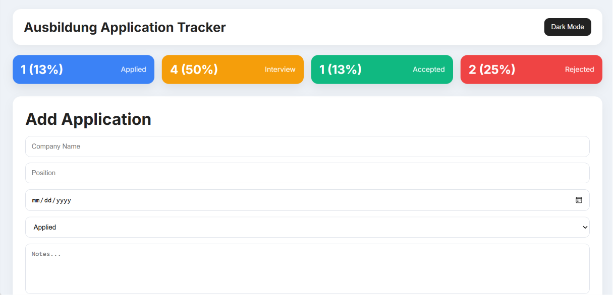
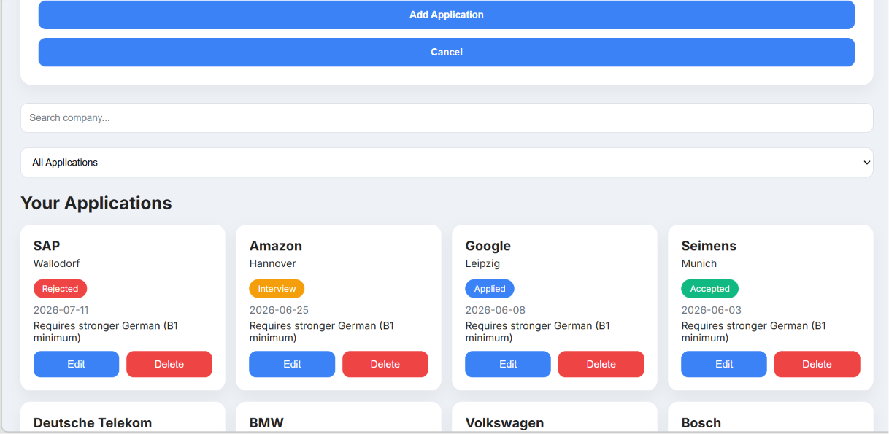

# 📊 Smart Task Tracker / Job Application Tracker

A modern and simple web application to track job applications efficiently with a clean and responsive UI.

---

## 🚀 Live Demo

👉 [View Live Demo]( https://modibodi057-collab.github.io/Ausbildung-Application-Tracker/)

---

## 📸 Preview

  
  
---

## 🎥 Demo Video

  <video src="https://github.com/user-attachments/assets/bfabe0e4-2fb0-4a5c-b820-fce9b6a2fdd4" width="100%" controls></video>

---

## ✨ Features

- Add new job applications or tasks
- Edit and delete entries easily
- Search functionality for quick access
- Filter by status (Applied / Interview / Accepted / Rejected)
- Live dashboard with statistics
- Dark mode support
- Fully responsive design
- Automatic data saving in browser

---

## 🛠️ Tech Stack

- HTML5  
- CSS3  
- JavaScript (Vanilla JS)

---

## 📚 What I Learned

- DOM manipulation and dynamic rendering  
- State management using JavaScript arrays  
- Building interactive UI components  
- Handling user input and events  
- Creating a full frontend project from scratch  

---

## 💡 How to Use

- Add a new application using the form  
- Search for specific entries  
- Filter by status  
- Edit or delete any item  

---

## 🎯 Project Purpose

This project was built to simulate a real-world tracking system and improve core frontend development skills while building a practical portfolio project.

---

## 📌 Note

This project was built without external frameworks to focus on JavaScript fundamentals and clean UI design.
---
## 👨‍💻 Author

Designed & Developed by MOHAMMAD BAYDOUN 
👉[GitHub](https://github.com/modibodi057-collab)
